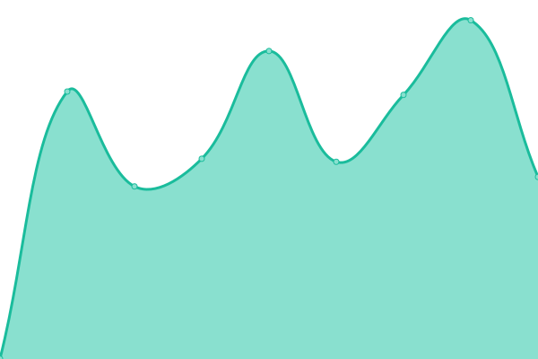
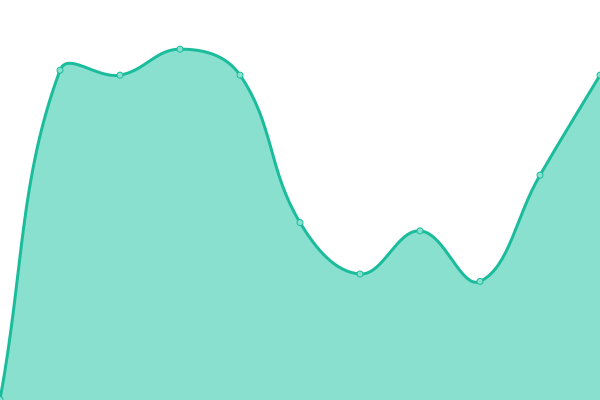

# [📈 Live Status](https://status.krastem.ru): <!--live status--> **🟩 All systems operational**

This repository contains the open-source uptime monitor and status page for [Krassystem](https://status.krastem.ru), powered by [Upptime](https://github.com/upptime/upptime).

With [Upptime](https://upptime.js.org), you can get your own unlimited and free uptime monitor and status page, powered entirely by a GitHub repository. We use [Issues](https://github.com/Krassystem/uptime/issues) as incident reports, [Actions](https://github.com/Krassystem/uptime/actions) as uptime monitors, and [Pages](https://status.krastem.ru) for the status page.

<!--start: status pages-->
<!-- This summary is generated by Upptime (https://github.com/upptime/upptime) -->
<!-- Do not edit this manually, your changes will be overwritten -->
<!-- prettier-ignore -->
| URL | Status | History | Response Time | Uptime |
| --- | ------ | ------- | ------------- | ------ |
|  [Крассистем](https://krassystem-service.ru) | 🟩 Up | [krassistem.yml](https://github.com/Krassystem/uptime/commits/HEAD/history/krassistem.yml) | 

 1580ms
     
 | 

<a href="https://status.krastem.ru/history/krassistem">100.00%</a>
    

|  [АТиДХ](https://profavtodormo.ru) | 🟩 Up | [a-ti-dh.yml](https://github.com/Krassystem/uptime/commits/HEAD/history/a-ti-dh.yml) | 

 1188ms
     
 | 

<a href="https://status.krastem.ru/history/a-ti-dh">100.00%</a>
    

|  [Лари](https://lariclinic.ru) | 🟩 Up | [lari.yml](https://github.com/Krassystem/uptime/commits/HEAD/history/lari.yml) | 

 867ms
     
 | 

<a href="https://status.krastem.ru/history/lari">100.00%</a>
    

|  [Интакто](https://intacto.ru) | 🟩 Up | [intakto.yml](https://github.com/Krassystem/uptime/commits/HEAD/history/intakto.yml) | 

 1006ms
     
 | 

<a href="https://status.krastem.ru/history/intakto">100.00%</a>
    

|  [ЧООП](https://ratibor-krasnogorsk.ru) | 🟩 Up | [ch-oop.yml](https://github.com/Krassystem/uptime/commits/HEAD/history/ch-oop.yml) | 

 983ms
     
 | 

<a href="https://status.krastem.ru/history/ch-oop">100.00%</a>
    

<!--end: status pages-->

[**Visit our status website →**](https://status.krastem.ru)

## 📄 License

- Powered by: [Upptime](https://github.com/upptime/upptime)
- Code: [MIT](./LICENSE) © [Anand Chowdhary](https://anandchowdhary.com), supported by [Pabio](https://pabio.com)
- Data in the `./history` directory: [Open Database License](https://opendatacommons.org/licenses/odbl/1-0/)
